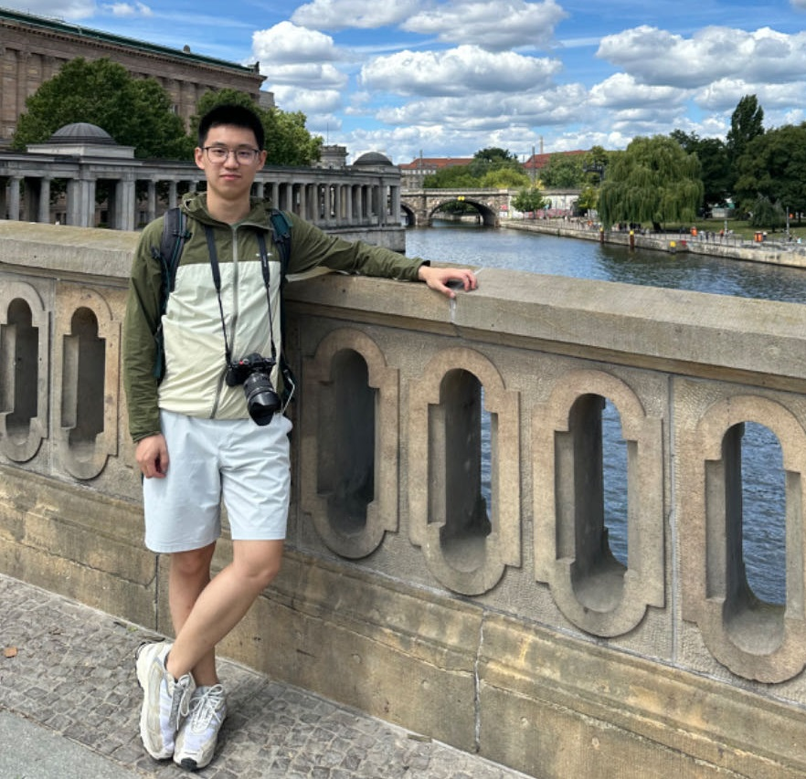
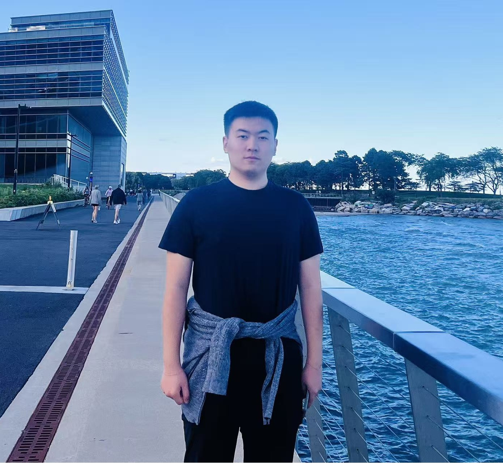

<h2 style="font-size: 36px; font-weight: bold; text-decoration: none; text-align: left;">Lab Director</h2>
<!-- 

  <h2 style="font-size: 36px; font-weight: bold; text-decoration: underline red;">Lab Director</h2>

 -->
<!-- **
  Lab Director  
** -->

  

    
  

  

    <h4>Sikai (Sky) Chen, Ph.D.</h4>
     
    
Assistant Professor 
    Department of Civil and Environmental Engineering 
    Department of Mechanical Engineering (Courtesy) 
     
    Associate Director 
    Digital Infrastructure, Data Science, and Artificial Intelligence Program 
    Smart Highway Research Center (SHRC) 
     
    University of Wisconsin-Madison 
     
    Office: Engineering Hall 2266 
    Email: <a href="sikai.chen@wisc.edu">sikai.chen@wisc.edu</a>

    

      
      &nbsp;
      
    

  

   <h5>Education:</h5>
<ul>
  <li>Ph.D., Civil Engineering / Computational Science & Engineering, Purdue University, 2019</li>
  <li>M.S., Transportation Engineering, University of Southern California, 2014</li>
</ul>
 

---
<h2 style="font-size: 36px; font-weight: bold; text-decoration: none; text-align: left;">Lab Members</h2>
<!-- 

  <h2 style="font-size: 36px; font-weight: bold; text-decoration: underline red;">Lab Members</h2>

 -->

<!-- **
  Lab Members  
** -->

<!-- 
<h3><strong>Postdoctoral Researchers</strong></h3>
 -->
<h3 style="text-align: left;"><strong>Postdoctoral Researchers</strong></h3>

<!-- Chengyuan Ma -->
<!-- 两个小图标的模板 -->

  <!-- 可以把间距缩小一点 -->
<!-- 
  将间距缩小一点并且页面居中 -->
  <!-- 
   页面居中 -->
    

    

      
      
 <!-- 修改了这一行，将上下padding设为较小的值 -->
        <!-- 其中，pt-2表示padding-top设为2px，pb-2表示padding-bottom设为1px -->
        
Chengyuan Ma

        
Research Associate

        
Spring 2023 - present

        
Email: <a href="cma97@wisc.edu">cma97@wisc.edu</a>
 
        
(Co-advise with Prof. Xiaopeng Li)

        
Ph.D., Tongji University, 2023
 
        
B.E., Tongji University, 2017

         
         
        
Research Interests: Urban Traffic Control, Traffic Data Analysis

         
        

          
   <!-- 三个图标的话删除这一行代码 -->
            
          
   <!-- 三个图标的话删除这一行代码 -->
          
    <!-- 三个图标的话删除这一行代码 -->
            
          
    <!-- 三个图标的话删除这一行代码 -->
        

      

    

  

<!-- Keke Long -->
  

    

      
      
 
      <!-- 修改了这一行，将上下padding设为较小的值 -->
      <!-- 其中，pt-2表示padding-top设为2px，pb-2表示padding-bottom设为1px -->
      <!-- 
 添加固定高度和溢出属性 -->
        
Keke Long

        
Research Associate

        
Spring 2025 - present

        
Email: <a href="klong23@wisc.edu">klong23@wisc.edu</a>
 
        
(Co-advise with Prof. Xiaopeng Li)

        
Ph.D., University of Wisconsin-Madison, 2024

        
M.S., Tongji University, 2021
 
        
B.E., Changan University, 2018
 
         
        
Research Interests: Vehicle Trajectory Optimization, Vehicle Control

         
        

          
   <!-- 三个图标的话删除这一行代码 -->
            
          
   <!-- 三个图标的话删除这一行代码 -->
          
    
            
          
   
        

      

    

  

<!-- 空一行 -->
 

---
<!-- 
<h3><strong>Ph.D. Students</strong></h3>
 -->

<h3 style="text-align: left;"><strong>Ph.D. Students</strong></h3>
<!-- 一行有三个人 -->
<!-- 正方形头像 -->

<!-- Zilin Huang -->
 
   <!-- px-2可以把card间距变大一点 -->
  

    
      
 <!-- 修改了这一行，将上下padding设为较小的值 -->
      <!-- 其中，pt-2表示padding-top设为2px，pb-2表示padding-bottom设为1px -->
      
Zilin Huang

      
Research Assistant
 
      
Fall 2022 - present

      
Email: <a href="zilin.huang@wisc.edu">zilin.huang@wisc.edu</a>

      
M.S., South China University of Technology, 2021
 
      
B.E., Guangdong University of Technology, 2018
 
       
      
Research Interests: Human-Centered AI, Autonomous Driving, Robotics, Human-Robot Interaction, Intelligent Transportation

       
      

        
        
        
        
      

    

  

<!-- Zihao Sheng -->
  

    

      
      
 <!-- 修改了这一行，将上下padding设为较小的值 -->
      <!-- 其中，pt-2表示padding-top设为2px，pb-2表示padding-bottom设为1px -->
        
Zihao Sheng

        
Research Assistant
 
        
Spring 2023 - present

        
Email: <a href="zihao.sheng@wisc.edu">zihao.sheng@wisc.edu</a>

        
M.S., Shanghai Jiao Tong University, 2022
 
        
B.E., Xi'an Jiaotong University, 2019
 
         
        
 <!-- 您可以自由调整这里的数值来达到您想要的间距 -->
        

        
Research Interests: Human-Centered AI, Autonomous Driving, Robotics, Physics, Intelligent Transportation

         
        

          
   <!-- 三个图标的话删除这一行代码 -->
            
          
   <!-- 三个图标的话删除这一行代码 -->
          
    <!-- 三个图标的话删除这一行代码 -->
            
          
    <!-- 三个图标的话删除这一行代码 -->
        

      

    

  

<!-- Zheng Li -->
  
   <!-- 页面居中 -->
    

      
      
 <!-- 修改了这一行，将上下padding设为较小的值 -->
      <!-- 其中，pt-2表示padding-top设为2px，pb-2表示padding-bottom设为1px -->
        
Zheng Li

        
Research Assistant

        
Fall 2023 - present

        
Email: <a href="zli2674@wisc.edu">zli2674@wisc.edu</a>
 
        
(Co-advise with Prof. Xiaopeng Li)

        
M.S., Tongji University, 2023
 
        
B.E., Hunan University, 2020
 
         
         
        
Research Interests: Autonomous Driving Safety Validation, Intelligent Transportation

         
        

          
   <!-- 三个图标的话删除这一行代码 -->
            
          
   <!-- 三个图标的话删除这一行代码 -->
          
    <!-- 三个图标的话删除这一行代码 -->
            
          
    <!-- 三个图标的话删除这一行代码 -->
        
      
      

    

  

  <!-- 可以把间距缩小一点 -->

<!-- Yongju Kim -->
  
   <!-- 页面居中 -->
    

      
      
 <!-- 修改了这一行，将上下padding设为较小的值 -->
      <!-- 其中，pt-2表示padding-top设为2px，pb-2表示padding-bottom设为1px -->
        
Yongju Kim

        
Research Assistant

        
Fall 2023 - present

        
Email: <a href="yongju.kim@wisc.edu">yongju.kim@wisc.edu</a>
 
        
(Co-advise with Prof. Sue Ahn)

        
M.S., Seoul National University, 2021
 
        
B.S., Seoul National University, 2019
 
         
        
Research Interests: Freeway Traffic Control, Traffic Simulation, Traffic Flow Theory

         
        

          
   <!-- 三个图标的话删除这一行代码 -->
            
          
   <!-- 三个图标的话删除这一行代码 -->
        
      
      

    

  

<!-- Yuhao Luo -->
  

    

      
      

        
Yuhao Luo

        
Research Assistant

        
Fall 2025 - present

        
Email: <a href="yluo955@connect.hkust-gz.edu.cn">yluo955@connect.hkust-gz.edu.cn</a>

        
M.S., The Hong Kong University of Science and Technology (GZ), 2025

        
B.E., Wuhan University of Technology, 2023

         
        
 <!-- 可以调整这个数值来控制间距 -->
        

        
Research Interests: Autonomous Driving, Uncertainty Quantification, Spatial-temporal data mining, and driving behavior modelling

        
 <!-- 调整了间距 -->
          

            

              
            

            

              
            

          

        

      

    

  

<!-- Zhengyang Wan -->
  

    

      <figure>
        

          
        

      </figure>
      

        
Zhengyang Wan

        
Research Assistant

        
Fall 2025 - present

        
Email: <a href="2233474@tongji.edu.cn">2233474@tongji.edu.cn</a>

        
M.S., Tongji University, 2025

        
B.E., Tongji University, 2022

         
        
Research Interests: Autonomous Driving, Vehicle Control, Human-Centered AI, Intelligent Transportation

         
        

            
            
            
        

      

    

  

 <!-- Boyue Wang -->
  

    

      
      

        
Boyue Wang

        
Research Assistant

        
Fall 2025 - present

        
Email: <a href="bwang367@wisc.edu">bwang367@wisc.edu</a>

        
B.E., Mechanical Engineering, University of Wisconsin-Madison, 2025

         
        
Research Interests: Autonomous Driving Simulation, Intelligent Transportation

         
        

          

            
          

        

      

    

  

<h3 style="text-align: left;"><strong> Undergraduate Researchers</strong></h3>

 
 <!-- Xin Yi Chen -->
  

    

      
      

        
Xin Yi Chen

        
Undergraduate Researcher

        
Spring 2025 - present

        
Email: <a href="xychen@wisc.edu">xychen@wisc.edu</a>

        
Civil Engineering / Electrical & Computer Engineering, University of Wisconsin-Madison

         
        
Research Interests: Human-centered, AI-integrated transportation systems development

         
        

          

            
          

        

      

    

  

---
<h3 style="text-align: left;"><strong>Affiliates</strong></h3>

  <!-- Yansong Qu -->
  

    

      
      

        
Yansong Qu

        
Teaching Assistant

        
Fall 2024 - present

        
Purdue University, co-advised with Prof. Samuel Labi

        
Email: <a href="qu120@purdue.edu">qu120@purdue.edu</a>

        
M.S., Beijing University of Technology, 2025

        
B.E., Dalian Jiaotong University, 2021

         
        
Research Interests: Autonomous Driving Simulation, Human-Centered AI, Control, Intelligent Transportation

         
        

            
            
            
        

      

    

  

  <!-- Jiancong Chen -->
  

    

      
      

        
Jiancong Chen

        
Research Assistant

        
Fall 2024 - present

        
Purdue University, co-advised with Prof. Samuel Labi

        
Email: <a href="chen5281@purdue.edu">chen5281@purdue.edu</a>

        
M.S., Southeast University, 2025

        
B.E., Chang'an University, 2021

         
         
        
Research Interests: Autonomous Driving, Driving Behavior, Traffic Safety, Intelligent Transportation

         
        

          

            
          

          

            
          

        

      

    

  

  <!-- Yixian (Nick) Zhong -->
  

    

      <figure>
        

          
        

      </figure>
      

        
Yixian (Nick) Zhong

        
Undergraduate Researcher

        
Fall 2025 - present

        
Email: <a href="nick.zhong@rutgers.edu">nick.zhong@rutgers.edu</a>

         
        
Statistics, School of Arts and Sciences

        
Rutgers University - New Brunswick

         
         
         
        
Research Interests: Data science in Intelligent Transportation Systems

         
         
        <!-- 

            
            
            
        
 -->
      

    

  

 

---
<h3 style="text-align: left;"><strong>Sky-Lab Alumni</strong></h3>

  
  <!-- Keke Long -->
  

    

      
      
 
      <!-- 修改了这一行，将上下padding设为较小的值 -->
      <!-- 其中，pt-2表示padding-top设为2px，pb-2表示padding-bottom设为1px -->
      <!-- 
 添加固定高度和溢出属性 -->
        
Keke Long

        
CEE Ph.D.

        
Spring 2023 - Fall 2024

        
Email: <a href="klong23@wisc.edu">klong23@wisc.edu</a>
 
        
University of Wisconsin-Madison, co-advised with Prof. Xiaopeng Li

         
        
Current Position: Postdoc, University of Wisconsin-Madison

         
         
        

          
   <!-- 三个图标的话删除这一行代码 -->
            
          
   <!-- 三个图标的话删除这一行代码 -->
          
    
            
          
   
        

      

    

  

  
  <!-- Jiqian (Frank) Dong -->
  

    

      
      

        
Jiqian (Frank) Dong

        
CEE Ph.D., ECE MS

        
Fall 2019 - Spring 2024

        
Purdue University, co-advised with Prof. Samuel Labi

        
Email: <a href="dong282@purdue.edu">dong282@purdue.edu</a>

         
        
Research Interests: AI-based control for CAVs, Machine learning for autonomous driving, Connected infrastructure system

        <!-- 

 -->
         
        

          
          
          
          
        

      

    

  

<!-- Runjia (Rayne) Du -->
  

    

      
      

        
Runjia (Rayne) Du

        
CEE Ph.D.

        
Fall 2019 - Fall 2023

        
Purdue University, co-advised with Prof. Samuel Labi

        
Email: <a href="du187@purdue.edu">du187@purdue.edu</a>

         
          
Current Position: Research Engineer, Bot Auto

         
         
        

          
          
          
        

      

    

  

  

<!-- Paul (Young Joun) Ha -->

  

    

      
      

        
Paul (Young Joun) Ha

        
CEE Ph.D.

        
Fall 2019 - Fall 2023

        
Purdue University, co-advised with Prof. Samuel Labi

        
Email: <a href="ha55@purdue.edu">ha55@purdue.edu</a>

         
        
Current Position: Assistant Research Professor, University of Connecticut - Connecticut Transportation Institute

         
        

          
          
          
        

      

    

  

<!-- Jiaming Wang -->
 

  

    
      

        
Jiaming Wang

        
ECE MS

        
Fall 2022 - Spring 2024

        
Purdue University, co-advised with Prof. Samuel Labi

        
Email: <a href="wang4146@purdue.edu">wang4146@purdue.edu</a>

         
        
Current Position: Software Engineer, Meituan

         
         
        

          

            
          

        

      

    

  

<!-- Suya (Sue) Zong -->
  

      
      

        
Suya (Sue) Zong

        
CEE MS

        
Fall 2020 - Summer 2022
 
        
Purdue University, co-advised with Prof. Samuel Labi

        
Email: <a href="shuyazong@microsoft.com">shuyazong@microsoft.com</a>

         
        
Current Position: Product Manager, Microsoft Software and Technology Center Asia

         
        

          

            
        

      

    

  

<!-- Yujie Li -->
  

    

      
      

        
Yujie Li

        
Research Assistant

        
Fall 2019 - present

        
Purdue University, co-advised with Prof. Samuel Labi

        
Email: <a href="li2804@purdue.edu">li2804@purdue.edu</a>

         
        
Research Interests: Optimal and AI-based control for CAVs, Human factors in AV technologies

         
        

          

            
          

          

            
          

        

      

    

  

<!-- Qichao Liu -->
 

  

    
      

        
Qichao Liu

        
Visiting Ph.D. Student

        
Spring 2024 - Spring 2025

        
Southeast University

        
Email: <a href="qliu426@wisc.edu">qliu426@wisc.edu</a>

         
        <!-- 

 -->
        
Research Interests: Automated Vehicles, Optimal Control, Optimization, Distributed Control

         
         
         
      

    

  

<!-- Penglin Song -->
  

    

      
      

        
Penglin Song

        
Visiting Ph.D. Student

        
Spring 2023 - Summer 2023

        
The Hong Kong Polytechnic University

        
Email: <a href="peng-lin.song@connect.polyu.hk">peng-lin.song@connect.polyu.hk</a>

         
        <!-- 

 -->
        
Research Interests: Proactive safety, Econometric methods application, Surrogate safety measures

         
         
        

          

            
          

          

            
          

        

      

    

  

<!-- Zhongnan Ye -->
  

                              <!-- *****重要，之后更新的时候参考***** 这里空行是指： 可以不用每3个card之后重新起一行，而是直接在这里加个空行即可 -->
    

      
      

        
Zhongnan Ye

        
Visiting Ph.D. Student

        
Summer 2022 - Fall 2022

        
The Hong Kong Polytechnic University

        
Email: <a href="zhong-nan.ye@connect.polyu.hk">zhong-nan.ye@connect.polyu.hk</a>

         
        
Research Interests: Path planning, Structural safety engineering, Fire emergency management, Building energy modeling

         
        

          

            
          

          

            
          

        

      

    

  

